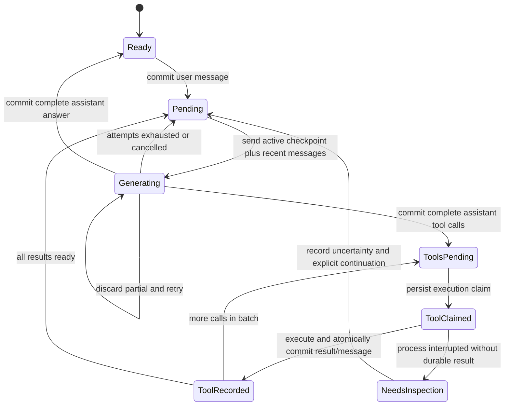

# Builder architecture

Builder is a local, durable agent runtime with a terminal adapter. Its central design decision is that the database owns the conversation; the model connection does not.

## Boundaries

| Crate | Owns | Does not own |
| --- | --- | --- |
| `builder-core` | Role/message types, configuration, SQLite repository, session locks | HTTP transport, terminal UI, tool execution |
| `builder-provider` | Provider contract, request serialization, retry classification, stream assembly | Durable messages, permission decisions, filesystem execution |
| `builder-tools` | Typed action decoding, tool schemas, path resolution, bounded I/O, subprocess ownership | Model calls, conversation policy, permission UI |
| `builder` | Agent orchestration, context budget, approval policy, CLI and rendering | Provider-specific retry decisions or ad-hoc file mutations |

`Agent<P: Provider>` uses static dispatch. The provider interface returns a future without requiring a runtime trait-object allocation or an async-trait dependency. Terminal rendering consumes application events; the provider only emits model events. A second provider can be implemented independently of the agent, tools, and storage. A second UI can call the application engine independently of the terminal adapter.

The core repository is intentionally concrete SQLite, not a generic storage abstraction with one implementation. Extract a repository trait when a second backend or a demonstrable testing need exists. The same rule applies to plugin registries and distributed services: add abstractions for real variation.

## Turn state machine

Conversation readiness is derived from active durable messages. A final user message, tool result, or assistant tool request means work is pending. A normal assistant answer means ready. Avoid maintaining a second in-memory status that could disagree after a crash.

The `attempts` table is an audit of logical generations, each of which may contain multiple HTTP attempts. It is not authoritative turn state. An abrupt process exit can leave an audit row `running`; recovery still follows the committed conversation. Partial token deltas are intentionally transient.

## Persistence invariants

1. Commit the user message before building its model request.
2. Build retry bodies once from committed state. Never append a partial response to retry input.
3. A provider's successful return must be a complete, validated assistant message.
4. Commit the entire assistant tool-call batch before dispatching any tool.
5. Claim each call ID durably before running it. Reject call ID reuse across generations.
6. Store the tool result and corresponding conversation message in a single transaction.
7. Do not automatically replay a claimed tool without a durable result; stop for inspection.
8. Hold the session's OS file lock for the agent's full lifetime.
9. Never silently drop history to fit a context window.

Schema v5 adds a nullable tool outcome column. New executions atomically save a
`ToolOutcome` enum alongside the result and conversation message. Legacy rows
remain unknown; output wording is not interpreted as an execution fact. Loop
guards classify decoded actions and recorded outcomes. A successful direct write
resets inspection only when bounded before/after source hashes differ; candidate
application validates nonempty changing patches. Provider messages are unchanged.

SQLite WAL and full synchronization protect committed writes within the guarantees of the operating system and storage device. Database schema versions newer than the binary are rejected. Schema v2 adds an active flag to messages and a durable composer draft table in a transaction; the v1 upgrade preserves existing messages and tool claims. User-facing IDs are UUIDs; unique prefixes are resolved before obtaining the lock.

## Failure semantics

| Failure | Behavior |
| --- | --- |
| Disconnect before completion | Discard partial assembly; retry identical committed input |
| HTTP 408, 429, 500, 502, 503, 504 | Bounded exponential backoff with jitter / numeric Retry-After |
| HTTP 400, 401, 403, other nonretryable status | Stop immediately; keep pending turn |
| Invalid SSE or invalid tool arguments | Stop without dispatching the response |
| Successful finish with empty or reasoning-only output | Discard attempt output; retry identical committed input within configured `max_attempts`; pause on exhaustion |
| `length` or unsupported finish reason | Stop; do not commit incomplete output |
| Normal finish reason then EOF | Accept for compatible servers that omit `[DONE]` |
| Exhausted retry budget | Return actionable error; session remains resumable |
| Tool error or denial | Commit an error/denial tool result for the model |
| Crash after tool side effects, before result | Mark uncertain; halt recovery for inspection |
| Context threshold reached | Summarize older context into an atomic checkpoint; keep original rows |
| Uncompactable context | Keep original history and stop with an actionable error |

This is not exactly-once execution. No local journal can atomically commit an arbitrary external command's side effects with a SQLite transaction. The guarantee is **no automatic replay of an ambiguous existing call**. A model could propose a semantically equivalent new call; uncertainty halts recovery before the next generation, and the user must inspect before continuing.

## Ownership and cancellation

The interactive input adapter is split into `input/buffer.rs` (editable atoms and shared paste blocks), `input/layout.rs` (cell-width-aware layout), `input/screen.rs` (RAII terminal ownership and bounded painting), and `input/mod.rs` (events, commands, and history). These modules have no dependency on HTTP or SQLite. The rendering adapter keeps theme and streaming escape filtering separate. The application coalesces model output on a 16 ms timer; persistence still commits complete messages at the same durability boundaries.

The application owns the store, session lock, provider, and workspace. A generation owns its parser and partial response; dropping its future drops its HTTP stream. The CLI selects between an agent future and Ctrl-C. RAII releases the session lock and progress indicators.

Tools bound file sizes and returned output. On Unix, a shell tool owns a process-group guard that terminates non-detached descendants on cancellation, timeout, or completion. `kill_on_drop` protects the direct child as well. File operations are synchronous and bounded; large directory searches may delay cancellation. A worker pool is a possible later optimization, but cancellation must still leave mutations explicitly uncertain.

## Protocol and configuration

The adapter currently accepts OpenAI-compatible Chat Completions with text content and function calls. It handles LF/CRLF SSE framing, comments, multi-line event data, arbitrary network byte boundaries, interleaved tool-call indices, and streamed function arguments. It requires an explicit successful finish reason, rejects empty/invalid responses, and bounds assembly memory.

Configuration uses named profiles and environment-variable references for keys. Unknown TOML fields fail loudly. HTTP redirects are disabled so credentials cannot follow a provider redirect. HTTP error bodies are excluded from persisted transport errors because proxies can echo secrets. This is not general transcript secret redaction: files and tool output may contain sensitive data and are persisted locally and sent to the selected endpoint.

## Extension rules

- **Another protocol:** implement `Provider`, normalize into core messages, and run the same failure contract tests. Introduce an enum to select adapters when there is actually a second implementation.
- **Another tool:** add a typed action, schema, risk classification, bounded executor, and permission/recovery tests. Keep journal ownership in the agent.
- **Another UI:** consume `AgentEvent`, supply an approval callback, and preserve cancellation and session-lock ownership.
- **Context compaction:** extend the checkpoint projection while preserving originals, tool batch boundaries, execution constraints, and cancellation atomicity.
- **A sandbox:** add an execution backend with documented OS guarantees. Path validation and approval prompts are not a sandbox.
- **Database migration:** add a transactional version step and a fixture-based upgrade test. Never downgrade or reset an unknown schema.

## Validation

Integration tests run real local HTTP listeners and inspect complete request bodies across retries. They verify the behavior users depend on, rather than only matching parser implementation details. Filesystem tests operate in temporary directories. The CLI is tested as a subprocess with isolated configuration and sessions. Strict Clippy, formatting, and all workspace tests run in CI.

## Configuration boundaries

External formats live in `builder-core::config::import`: Continue YAML and OpenCode custom-provider JSON/JSONC translate into a single native `Profile`. Neither the agent nor the HTTP adapter interprets external schemas. Imports validate the complete set before merging, reject unintended name collisions, retain model roles, and select a chat-capable default. Embedding-only profiles cannot enter the agent loop.

`Secret` represents a literal or a deferred environment reference. Debug formatting always redacts it; user-facing config display creates a redacted copy. Config replacement uses a unique private temporary file, sync, and rename (plus directory sync on Unix). External parser diagnostics never quote config source. These controls protect display and local storage permissions, not memory encryption or access by the same OS user.

The provider resolves credentials once per process and builds one sensitive HTTP header map for discovery and all generation attempts. Explicit Authorization takes precedence over bearer API keys. Completion options are typed; extension body properties cannot replace protocol-owned request fields. Retries reuse the same fully assembled request body and auth. Updating credentials requires restarting Builder; committed sessions remain independent of credentials.

## Interruption and explicit rewind

Ctrl+C drops the active future and marks running attempt audit rows interrupted without altering the retry context. Interactive resume opens the composer instead of automatically driving unfinished work. `/retry` explicitly continues; a new instruction transactionally closes pending calls, records cancellation, and appends the new user message. Completed tool results remain intact. Calls without claims receive cancelled results; calls with claims but no results receive uncertain results. Discovering uncertainty returns an error after saving the follow-up, so the UI stops before generation and asks for inspection and explicit `/retry`. `/cancel` closes the pending turn without a new user message or provider request.

`/rewind` transactionally archives the last active user turn using `messages.active=0` and stores the original prompt in `composer_drafts`. No transcript rows or tool claims are deleted. Active context excludes archived rows; `/history archived` reads them explicitly. A runtime note tells the model to inspect current workspace state when a rewound turn contained tools. Rewind does not roll back side effects. The next submitted user message clears the durable draft in its persistence transaction. Ordinary edits to an unsent draft remain in memory as before; the original rewound prompt stays durable until submission. Tool IDs are checked against active and archived history to prevent reuse.

## Automatic context compaction (schema v3)

Profiles default to `auto_compact=true` and `compact_at_percent=75`. Before a normal model request, after committed tool batches are resolved, the agent checks estimated input plus schemas and reserved output. Manual `/compact` refuses unresolved tool batches and never executes them. The summarizer receives only data fragments, a handoff instruction, and the latest user request; tools are omitted. Every fragment fits the configured input/output budget; at most 32 fragments are allowed. Invalid, oversized, incomplete, tool-bearing, or cancelled summaries never activate a checkpoint.

`context_checkpoints` stores the projected context, the last original message sequence it covers, creation time, and an active flag. One transaction checks/activates a completed projection, deactivating prior checkpoints without deleting them. Original `messages` rows remain unchanged. `Store::messages` returns the checkpoint plus later active rows, while `history_messages` returns the full unretracted transcript. Archived history includes original rows covered by checkpoints. Tool IDs stay reserved against all original rows. Rewind invalidates checkpoints and restores the preceding original conversation, allowing a fresh compacted projection on continuation.

System messages and the latest user request remain exact. Recent tool requests/results stay grouped; oversized older exchanges become summary data. Denied/uncertain execution details are copied verbatim into explicit runtime constraints so they do not depend on summary quality. Other summary details are lossy and labelled as such. Compaction preserves whether a turn is pending or complete. It neither undoes nor replays workspace actions.

Provider `OutputLimit` is a typed terminal generation failure. The agent may retry it once per run with a doubled output allowance, bounded by 32,768 and available context. Network retries keep identical request bodies; this distinct generation recovery intentionally changes the output allowance while discarding all provisional output. Each checkpoint fragment has its own single output-limit retry, with headroom reserved before splitting input. Its initial generation allowance follows the profile up to 16,384 tokens; the retry doubles it up to 32,768. The stored handoff remains separately bounded to at most 4,096 estimated tokens, independent of hidden reasoning. A complete but oversized handoff gets one separate shortening retry using the exact original evidence with a tighter instruction, never a truncated or rejected draft. Length recovery and shortening can each occur at most once per fragment (three logical generations maximum). Empty, wrong-role, tool-bearing, and repeatedly oversized results fail with specific diagnostics. A failed retry leaves the entire previous context active.

### Bounded source inspection

Whole-file reads are allowed through 200 lines; larger files require explicit start/end lines. All read results are limited to 500 lines and 12 KiB including formatting, rejecting oversized ranges rather than silently clipping source. Search returns at most 30 matches and 8 KiB with explicit truncation notices. Shell retains its separate 32 KiB cap; prompts discourage using it to bypass source-read limits, but command contents are not mechanically classified.

Failed exact-text edits report the match count and keep the file unchanged. When the first nonblank old line has one whitespace-trimmed candidate, the error includes up to eight current source lines (2 KiB) as a diagnostic anchor. This is not fuzzy replacement: only a subsequent unique exact-text request can change the file. Line-number prefixes are omitted from this excerpt to avoid confusing them with source indentation. Edits with identical old/new text are rejected; writes of identical existing contents return UNCHANGED without a backup or write. Neither resets the investigation streak.

Each compaction rebuilds a deterministic inventory from successful read_file calls in unretracted original history. It stores the newest 32 distinct path/range entries within 4 KiB and labels omissions. Source reads use `number|source`, with exact indentation after the first `|`, to keep display padding out of exact-text edits. The inventory parser also accepts legacy space-separated numbered results without migration. The inventory is historical evidence, not a content cache or permission to assume unchanged files. Denials/errors are excluded. The handoff prompt asks for per-file findings, remaining questions, and the next action; findings remain model-generated and lossy. Inventory cost participates in budget checks, and it activates only with the atomic checkpoint. Targeted re-reads remain available for exact edits and freshness.

Empty successful finishes (including whitespace-only content) remain terminal
provider failures with the turn pending. The adapter distinguishes reasoning-only
responses in both streaming and JSON modes without retaining reasoning text.
Neither case triggers blind transport retries or substitutes reasoning for an
assistant answer. Provider-specific thinking controls remain explicit profile
`extra_body` settings.

The transport combines consecutive leading system messages into one outbound
system message for Jinja templates that require exactly one. Their text and order
are preserved; durable history, non-leading messages, and tool/result ordering
are unchanged. Retries still send an identical body.

The agent computes a no-progress streak from original unrewound history, not
the compacted projection. A user message or successful typed edit/write resets it;
every other completed tool increments it, including shell execution, research and
memory operations, failed calls, and denied or unchanged mutations. Exit status,
tool output wording, and model-authored status never establish file progress. At
the profile's configured `progress_check_calls`, recovery adds request-only
guidance and narrows broad discovery without changing the active projection.
Progress and failure recovery never summarize, checkpoint, or archive context.
Only configured context-pressure compaction and explicit `/compact` do that.

Request-only progress guidance and a clearly labelled runtime continuation message
are reserved in the context budget. They are not saved as new user instructions.
After the configured progress threshold, broad `list_files` and `search` discovery is
removed from recovery requests until a successful typed file change or new user
instruction resets the streak. Targeted reads, edits, and verification remain
available; progress checks never force mutations, and shell must not be used to
bypass the discovery restriction. The per-response tool limit is profile-configured.
Oversized, malformed, duplicate-ID, reused-ID, and unknown-tool batches are rejected
before persistence or dispatch. Normalized shell name/argument pairs are counted
from durable original history after the latest user instruction or successful file
change. The configured identical-shell limit is enforced before persistence or
dispatch. A saved pending batch
is validated before any unclaimed call executes after restart. A previously claimed
call takes precedence over structural and liveness checks and remains uncertain rather than
being replayed. An identical execute or mutation request following a denied or
uncertain outcome is rejected immediately until a new user instruction resets that
prohibition; a successful unrelated edit does not erase it. Compaction and restart
cannot reset either counter. Approval and uncertainty checks are unchanged. The
last guided round is mechanically tool-free and its continuation text agrees that
tools are unavailable. Its streamed text is buffered until validation so literal
tool-control markup cannot leak into the terminal or be accepted as an answer. A
raw or structured tool request is discarded without execution and gets one
bounded plain-prose retry; a second rejection closes with a deterministic, honest
runtime failure instead of looping. Reaching the hard no-progress limit on a later run goes
directly to that tool-free conclusion instead of restarting the guided sequence
or requiring another retry.
Before every saved unclaimed call, the agent recomputes durable progress and policy
state. The no-progress execution ceiling is the configured progress threshold plus
the configured recovery rounds, including across batches, compaction, restart, and
retry. Reaching that limit forces a tool-free final-answer request. A finished result
omitted by a malformed legacy projection is restored from durable state without
execution; restored uncertainty pauses before another model request. Durable memory
and task updates participate in the denied/uncertain replay guard even though their
approval risk is read-like. A new user message resets the streak.
Pending batches always resolve before recovery. These controls bound repetitive
investigation, not total execution time or model competence.

## Derived memory (schema v4)

Core owns revisioned memory records, FTS5, vector blobs, per-session proposed task state, and extraction cursors. Application `MemoryRuntime` owns evidence validation, checkout isolation, hybrid ranking, extraction and context selection. The provider owns bounded embeddings HTTP. Tools supply source-version hashes and typed memory actions; they cannot directly access the memory database.

Every finding revision is immutable and current revisions advance with compare-and-swap. Forgetting tombstones retrieval while retaining audit rows. Source hashes and active original event sequences are validated at retrieval and update. Rewound evidence is never treated as current. Task proposals older than the latest user correction are omitted. Global preferences require explicit user commands; model-derived findings remain checkout scoped and cannot grant permission.

A missing current-revision vector is a durable pending job. Model/prefix/revision fingerprints prevent mixing vector spaces; a late vector cannot attach to a newer revision. Bounded indexing retries during later idle maintenance and degrades to FTS on network failure. Derived packets remove whole optional records to meet a 6,000-byte cap; raw messages remain untouched and packet cost participates in context budgeting. Foreground packets use lexical retrieval so embedding work cannot delay a chat request. Extraction and vector indexing run only in a cancellable post-answer idle task; a new foreground request cancels that task first. Extraction is bounded and tool-free, and requests a JSON-mode response when the endpoint supports it. It saves individually atomic revisions, then task state; the durable cursor is marked done only after saving task state. A failed or cancelled batch keeps its cursor, so a later idle pass reconsiders the same evidence; partial batch progress is valid and no raw history is discarded. See [memory behavior and limits](docs/MEMORY.md).

## Evidence-driven research runtime

`builder-core::research` defines closed research request states and bounded queries
against original journal rows. `builder-tools::research` owns artifact selection,
source fingerprints, AST navigation, disposable candidate copies and checks;
`builder-tools::semantic` owns short-lived stdio language-server sessions.
`builder::research` owns evidence policy, procedural retrieval, independent model
analysis/review and completion criteria. The crate graph remains acyclic.

Research operations use the existing committed batch/claim/atomic result path. No
new schema or sidecar mutable task state is introduced. Missing, failed, denied,
rewound or stale evidence cannot establish a passing verification. Broad source
fingerprints invalidate checks and procedures when callers/contracts change; exact
JSON/anchor selectors allow finer observation freshness. Fingerprints have an
explicit bounded scope and are not claims about external service/environment state.

A recorded acceptance plan enables a completion gate. Unsupported final proposals
are retained in attempt audit details and are not committed as accepted assistant
completions. At most two corrective final attempts are allowed per run. The turn
remains pending on exhaustion. Verified completion requires all criteria plus a
current independent coverage review; unverified/blocked outcomes remain explicit.
Unplanned ordinary conversations retain their previous completion behavior. Runtime guidance requests a research finish only while the current turn has a recorded acceptance plan; unplanned legacy sessions may report actual test results directly without starting a workflow merely to close completed work.

Phase-specific procedures are derived from the newest 256 completed research
records. Retrieval revalidates proof at use time and withholds stale procedure
text. Original records remain accessible through explicit paginated history reads.
Candidate attempts are counted from durable claims after the active user message;
compaction and restart do not reset their bound. Candidate application rechecks
source preconditions and never replays uncertain side effects. See
[RESEARCH_RUNTIME.md](docs/RESEARCH_RUNTIME.md) for operations, limits and evaluation.

### Profile-local pipeline policy

`config::PipelineSettings` provides validated defaults for legacy profiles, typed
feature switches and bounded resource budgets. CLI persistent updates and transient
`--pipeline KEY=VALUE` overrides share one atomic decoder. Profile selection occurs
before transient overrides, including saved-session resume. Overrides never mutate
the saved configuration. Pipeline policy stays in the application and tool layers;
it is not sent as provider-specific API configuration.

The tool schema advertises enabled operations, and dispatch checks the same policy
before executing each claimed research call. Thus disabling a feature also blocks
previously queued calls, without replay or erasure. Default operation wrappers retain
the existing library API; the agent uses explicit policy-aware entry points.
Disabling the completion gate changes final-answer enforcement, never source
freshness or side-effect permission rules. Disabling review removes the model-review
requirement, while a verified finish still requires current measured checks.
Budgets flow to source snapshots, subprocess/LSP lifetimes, submodel generation,
durable candidate counters and explicit history/retrieval pages. A smaller retrieval
window cannot hide the acceptance plan; unavailable proof fails closed.

### Repeated tool failures

Three consecutive error results trigger one explicit checkpoint recovery with original
rows retained, followed by at most three corrective model rounds. This uses original
unrewound history and survives restart. An already active investigation recovery keeps
its existing bound instead of starting a second recovery. Successful tool results or
new user instructions reset the failure streak. Exhaustion pauses with unfinished work;
it never invents successful completion or replays an uncertain claim. Research requests
and artifact selectors advertise disjoint schemas with operation-specific required fields
and no extra properties; runtime decoding and permissions remain independently enforced.
Committed research results include their session-qualified record_id for follow-up
references. This label does not bypass evidence lookup or source freshness.

Automatic memory extraction considers only fresh source evidence and runs at most once
per post-answer idle pass. No eligible evidence means no model request. Foreground
requests and compaction never wait for extraction or indexing; a new request cancels
idle maintenance before model work begins. Automatic foreground retrieval is lexical.
Explicit remote embedding calls have a three-second application deadline and open a
per-pass circuit on failure; indexing handles at most two records per pass and missing
vectors stay queued. Lexical retrieval and source validation continue.

### Local embedding generation

Memory configuration defaults to an explicit Local backend; a legacy remote profile name
alone never enables HTTP generation. Local, Remote and Lexical are closed core settings.
Application memory policy selects the provider; the agent has no model-backend details.
The provider's local implementation loads pinned, size/hash-checked MiniLM ONNX and
tokenizer assets. Only explicit model setup downloads them, without chat credentials.
FastEmbed is compiled without its online model-loading feature. Ordinary generation
cannot download assets or silently fall back to a remote endpoint.

CPU inference uses fixed dimensions, bounded input/token length and two intra-op threads.
An owned async mutex guard moves into one blocking inference worker, preventing timeout
or cancellation from creating additional queued blocking work. In-flight numerical work
can finish after caller cancellation, but cannot mutate workspace files or the journal.
Local vectors have a separate model/revision/pooling fingerprint from remote vectors;
old revisions remain intact and current notes are reindexed as pending local jobs.
Freshness checks, permission rules and original transcript persistence are unchanged.
The `/memory` menu installs/selects local mode, keyword-only mode, or disables memory;
its selection applies immediately and persists atomically. CLI setup commits configuration
only after verified model installation and successful local inference.

### Checkout code index

Code capture belongs to `builder-tools`, durable generations and vectors belong to
`builder-core`, and watcher/embedding/ranking policy belongs to the application.
This preserves the application → provider/tools → core dependency direction and
keeps provider details outside the agent state machine.

An application-owned recursive filesystem watcher is RAII-bound to the idle
maintenance thread. Its bounded one-item channel deliberately coalesces event
bursts; a configurable debounce combines editor save sequences. Generated and
dependency directories do not wake the scanner. Watch events are an acceleration,
not a correctness contract: configurable periodic complete scans remain active,
and explicit indexed search synchronously reconciles the current checkout.

A capture either satisfies every configured file/byte/chunk bound or fails. The
store publishes its files, chunks, FTS rows, state and new generation in one SQLite
transaction. It never exposes a prefix or mixes generations. If capture or
publication fails, the previous complete generation remains queryable and the
state records the bounded error. Deletions disappear on a successful replacement.
Canonical checkout paths scope all lexical, structural and dense artifacts.

Chunks carry their file digest, content digest, language, line range, declarations
and identifier references. Vectors are keyed by content digest plus the complete
embedding fingerprint, so unchanged content is reusable and model migrations do
not compare incompatible spaces. Missing vectors are a durable queue drained by
cancellable, bounded local batches during idle time. Exact/FTS retrieval remains
available during an embedding outage or partial vector generation.

Application ranking fuses exact/path signals, FTS5/BM25, an exact persisted
declaration/reference graph, separately labelled Git-history path priors and
similarity-above-threshold dense candidates. Common languages use bundled
Tree-sitter syntax trees while bounded fallback extraction covers the rest. It diversifies by path,
clips output, reports the independent ranks, and can abstain. Immediately before
return, each selected path is read and hashed through `Workspace`; raced or stale
chunks are withheld and removed. Returned code is navigation evidence and cannot
satisfy verification without current reads and checks.

Retrieval telemetry is a separate bounded table. It records query metadata,
candidate/return counts, result paths, semantic coverage, stale suppressions and
elapsed time, without duplicating source excerpts or model output. Git commit
subjects and changed paths occupy their own FTS table and are always returned as
historical leads. Current chunks introduced through history still pass the same
live source-digest check.

The agent selects phase-specific research schemas from typed completed actions and
durable `ToolOutcome` values after the latest user message. It does not inspect
prompt phrases, model names or assistant prose. A new instruction resets the phase.
The `/settings` switch can restore the full configured research schema.

`builder doctor` performs ordinary generation, JSON-object, native tool and
parallel tool-call probes through the provider interface. Results are stored by a
non-secret endpoint/model/settings fingerprint. They establish wire-protocol
conformance for those calls, not model intelligence or task completion.

The per-run generation budget defaults to 100 rounds and is configurable from
`/settings` (1–1000). The profile persists this limit independently of the research
master switch. An explicit `--max-rounds` overrides it at startup; saving the menu
applies its value immediately, including for `/retry`. The last five rounds carry
an ephemeral, token-accounted budget notice. Exhaustion pauses with durable work
pending, without synthesizing a completion or dispatching the last generation's
unclaimed calls. Explicit continuation recovers those calls under normal claim
and approval rules. Investigation and failure guards still apply independently.

## Remote browser adapter

`builder remote` exposes one canonical workspace through an application-layer
Axum adapter. The Docker distribution is static assets plus an nginx reverse
proxy; it has no workspace mounts, provider keys, database, or tool executor.
The host uses the same `Agent`, `Store`, `MemoryRuntime`, and session OS lock as
the terminal. The dependency direction remains application → provider/tools → core.

A four-permit semaphore bounds concurrent chats; a separate admission gate serializes
preparation and request-ID registration. Each chat has independent run, cancellation,
and approval state. A bounded registry retains up to 64 chat statuses, while
original transcripts remain durable. Each run owns its store,
agent, and full-lifetime session guard on a dedicated current-thread Tokio runtime.
Cancellation drops the agent future, marks running attempts interrupted, and
releases resources through RAII. Browser disconnects do not imply cancellation;
explicit Pause and host shutdown signal it. A synchronous approval callback waits
on a bounded channel on the worker, never on an HTTP executor thread, and denies
on cancellation or a two-minute timeout. Replies are tied to one run and approval
ID. No UI path can change the host's approval mode.

All API reads/writes authenticate with an owner-private random token. Mutations
also require the configured exact browser Origin; there is no cookie auth, CORS,
or credential-bearing URL. Static content applies a restrictive CSP and renders
transcript text without HTML interpretation. This is single-user remote access,
not a sandbox or a multi-tenant authorization system. The operator owns HTTPS,
proxy access control, and the private container-to-host transport.

HTTP operations never replay automatically. The host rejects duplicate accepted
request UUIDs for the process lifetime, bounded to 4,096 runs; this is not durable
idempotency after a host restart. Status and reconnect only read state. A restored
session requires explicit submission/retry, and uncertain tool execution retains
the engine's stop-for-inspection behavior. Transient previews (64 KiB) and notices
(32) are visibly bounded; they are not durable messages. History uses explicit
SQL pages of original rows, preserving compacted originals and offering rewound
rows separately. These display pages never alter active context or stored history.

Chat management uses the same workspace scope and session lock as execution. Schema
6 adds only `chat_metadata` archive flags; renames update session titles. Archive
is reversible and does not remove transcript, tool, or memory rows. Cancel and
rewind compare the caller’s active transcript tip while holding the session lock
before applying existing transactional store operations. A stale repeated rewind
is rejected. Rewind retains originals and its durable composer draft, never
undoing filesystem effects. Manual remote compaction invokes the existing explicit
checkpoint operation without continuing tool execution. Concurrent chats share
workspace files; they do not imply filesystem isolation.

## Configuration location

Human-edited TOML lives at `~/.config/builder/config.toml`, or under the explicit
absolute `XDG_CONFIG_HOME`. Application data keeps its existing platform directory.
An explicit `--home`/`BUILDER_HOME` preserves the self-contained config/data layout.
The application resolves and passes the config directory separately to the remote
adapter, so later runs reload the same file used by the CLI. Startup migrates only
legacy config text, using a synced owner-private temporary file and atomic
no-overwrite publication. Legacy config and all durable data remain untouched.
Invalid or oversized legacy config fails before publication without quoting secrets.
