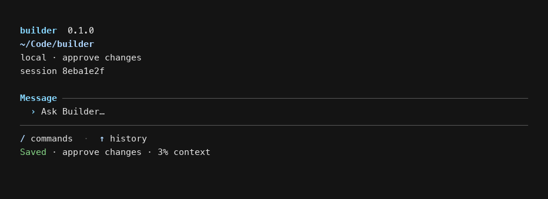
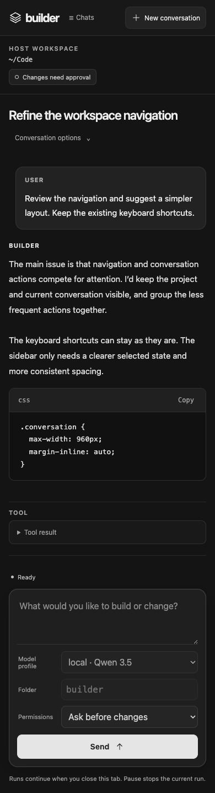

<p align="center"></p>
<h1 align="center">Builder</h1>
<p align="center"><strong>Your model. Your machine. Your code.</strong></p>
<p align="center">A local-first coding agent with durable conversations, deep repository context, and a browser you can open from anywhere.</p>
<p align="center">
  <a href="https://github.com/J-Reed700/builder/actions/workflows/ci.yml"></a>
  <a href="LICENSE"></a>
  <a href="https://www.rust-lang.org/"></a>
</p>
<p align="center">
  <a href="#quick-start">Quick start</a> ·
  <a href="#how-it-works">How it works</a> ·
  <a href="remote/README.md">Remote access</a> ·
  <a href="#documentation">Documentation</a>
</p>

<br>


## Built for work that lasts longer than one prompt

| Local-first | Durable by design | Model-agnostic |
| :--- | :--- | :--- |
| Code, tools, transcripts, memory, and credentials stay on the host running Builder. | Pause, retry, rewind, resume, and compact context without throwing away the original history. | Connect Ollama, LM Studio, llama.cpp, vLLM, or another OpenAI-compatible endpoint. |

Builder can inspect a repository, edit files, run approved commands, remember
useful context, and recover cleanly when a model or connection fails. Use it in
the terminal or connect the included browser interface to the same host.

## Quick start

### 1. Install

Builder requires Rust 1.95 or newer.

```sh
git clone https://github.com/J-Reed700/builder.git
cd builder
./install.sh
```

On Windows, run `cargo install --path . --locked` directly.

### 2. Connect a model

Create `~/.config/builder/config.toml`:

```toml
default_profile = "local"

[profiles.local]
base_url = "http://localhost:11434/v1"
model = "qwen3:8b"
```

Check that the endpoint supports the features Builder needs:

```sh
builder doctor
```

### 3. Start building

```sh
cd /path/to/project
builder
```

Builder asks before changing files or running commands. Use
`--approval read-only` to disable mutations or `--auto` to approve actions for
the current invocation.

## How it works

```text
you ──▶ Builder ──▶ your model endpoint
          │
          ├── workspace tools + approvals
          ├── durable SQLite journal
          ├── repository index
          └── optional local memory
```

- **Repository-aware.** Structural chunks, exact identifiers, FTS5/BM25,
  reference expansion, Git history, and optional embeddings feed bounded search.
- **Resumable.** Messages, tool claims, results, drafts, and context checkpoints
  are committed before Builder moves forward.
- **Failure-conscious.** Partial model output stays provisional. Interrupted
  tools with uncertain outcomes stop for inspection and are never replayed
  automatically.
- **Long-context ready.** Automatic compaction creates a bounded handoff while
  retaining every original transcript row.
- **Memory when you want it.** Optional lexical or semantic memory carries
  source-backed findings across conversations in the same checkout.
- **Remote without moving the work.** The browser connects to the host; the
  gateway never receives your source tree, model credentials, or Builder data.

## Terminal-first. Browser-ready.

<table>
  <tr>
    <td width="64%"></td>
    <td width="36%"></td>
  </tr>
</table>

Run a single task, return to an old conversation, or keep several browser chats
active at once:

```sh
builder run "Explain how this repository is organized"
builder sessions
builder resume SESSION_ID
builder export SESSION_ID --json
builder -C /path/to/project remote
```

For access through your own reverse proxy, deploy Builder Gateway and connect the
host with an outbound authenticated WebSocket. The complete threat model and
deployment guide live in [Remote control](docs/REMOTE_CONTROL.md).

## Safety model

Builder limits file access to the selected workspace, bounds reads and output,
and asks before mutations by default. Approved shell commands still run with the
permissions of the Builder process: path checks and approval prompts are safety
controls, not an OS sandbox.

Configuration lives under `~/.config/builder`; application data uses the
platform data directory. Both can be redirected with `--home` or `BUILDER_HOME`.
SQLite data and tool output are local plaintext. Relevant conversation, file,
and memory content is sent to the model endpoint you configure.

> **Project status:** Builder is early-stage software. Keep your workspace under
> version control and review commands before approving them.

## Documentation

| Guide | What it covers |
| :--- | :--- |
| [CLI guide](docs/CLI_GUIDE.md) | Commands, configuration, permissions, authentication, and imports |
| [Remote control](docs/REMOTE_CONTROL.md) | Browser access, gateway deployment, networking, and recovery |
| [Memory](docs/MEMORY.md) | Local and remote embeddings, provenance, invalidation, and retention |
| [Code index](docs/CODE_INDEX.md) | Index lifecycle, ranking, freshness, and settings |
| [Research runtime](docs/RESEARCH_RUNTIME.md) | Evidence, candidate experiments, verification, and feature switches |
| [Architecture](ARCHITECTURE.md) | Crate boundaries, persistence invariants, and failure semantics |

## Contributing

```sh
cargo fmt --all --check
cargo clippy --workspace --all-targets --locked -- -D warnings
cargo test --workspace --locked
```

See [CONTRIBUTING.md](CONTRIBUTING.md) for engineering conventions and pull
request guidance. Builder is available under the [MIT license](LICENSE).
