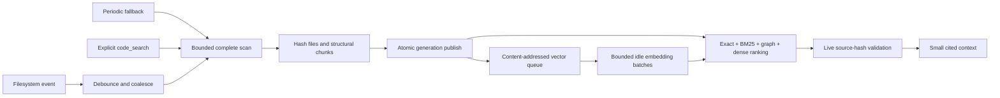

# Code index and repository retrieval

Builder maintains a checkout-scoped code index so the model can find relevant
source without filling its context with broad file listings and repeated literal
searches. It combines current source structure, exact identifiers and paths,
SQLite FTS5/BM25, an exact symbol/reference graph, repository-history priors, and optional local dense
vectors. Dense similarity proposes navigation candidates; it never establishes
that code is current or correct.

## Update lifecycle

The interactive idle worker owns a recursive operating-system filesystem watcher.
After a source event it waits for the configured debounce period, combines the
burst into one refresh, and rebuilds a bounded snapshot. The watcher ignores
generated dependency/build directories. A complete scan also runs on the
configured interval because filesystem APIs can drop or coalesce events, and an
explicit `code_search` refreshes synchronously before ranking.

Each scan walks the current checkout with ignore rules, hashes every accepted
source file, chunks it at language-aware declaration boundaries, and computes a
manifest hash. Publishing occurs in one SQLite transaction. A failed or
over-limit scan records the failure and leaves the last complete generation
queryable. Removed files disappear when the next generation is published.

Every result is checked against a fresh hash of its source file after ranking. A
result changed during the scan/search race is withheld and removed from the
active index. This retrieval-time check is the final freshness boundary; neither
the watcher nor the periodic scan is treated as proof.

Dense vectors are keyed by the chunk content hash and embedding fingerprint.
Unchanged chunks reuse their vectors across generations. Changed chunks become a
durable pending queue, and the cancellable idle worker embeds them in bounded
batches. Switching embedding models creates a separate vector space and queues
the current chunks for that fingerprint. Lexical, exact, and structural retrieval
continue while vectors are incomplete or embeddings are unavailable.

## Retrieval

Rust, Python, JavaScript/TypeScript, Go, and Java declarations come from bundled
Tree-sitter syntax trees. Other supported languages use a deterministic bounded
declaration fallback. Parser failure never turns into an unbounded read or a
partial generation.

`code_search` normalizes natural-language query words and identifier components,
then ranks independent candidate lists with reciprocal-rank fusion:

- exact symbol and path matches receive an explicit boost;
- FTS5 provides lexical/BM25 candidates;
- exact declaration/reference rows find symbols without tokenizer ambiguity;
- symbols declared by strong candidates seed exact reference expansion;
- recent Git commit subjects and changed paths can introduce current-file candidates;
- vectors above the configured cosine floor provide semantic candidates;
- final selection returns at most two chunks per file to preserve diversity.

The result includes paths, line spans, symbols, source hashes, excerpts, raw ranks,
cosine scores when available, the fused score, semantic coverage, embedding
errors, and any stale paths suppressed during the query. It explicitly abstains
when no candidate is supported. The model is instructed to read the returned
current range before editing.

A new user request can also receive a small automatic lexical packet from an
already-published generation. This path performs no foreground embedding and
uses at most four files with bounded excerpts. It is omitted when the context
budget cannot safely fit it.

## Controls and visibility

Open `/settings` in a chat to configure every code-index feature and budget:

| Setting | Default | Purpose |
| --- | ---: | --- |
| `code_index` | on | Master switch and `code_search` availability |
| `code_index_background` | on | Idle refresh and vector generation |
| `code_index_watch` | on | Recursive filesystem event updates |
| `code_index_auto_context` | on | Bounded automatic lexical context |
| `code_index_telemetry` | on | Bounded retrieval rank/latency/abstention metadata |
| `code_index_semantic` | on | Dense indexing/search when memory embeddings are enabled |
| `code_history` | on | Local Git commit/path ranking evidence |
| `code_index_refresh_secs` | 30 | Full-scan fallback interval |
| `code_index_debounce_ms` | 500 | Event burst coalescing delay |
| `code_index_embedding_batch` | 16 | Local embedding batch size |
| `code_index_embedding_timeout_secs` | 60 | Whole batch deadline |
| `code_search_results` | 10 | Maximum diversified results |
| `code_index_lexical_candidates` | 100 | FTS5/BM25 pool before fusion |
| `code_index_exact_candidates` | 100 | Exact symbol/reference pool before fusion |
| `code_index_dense_candidates` | 100 | Dense pool after the similarity floor |
| `code_index_history_results` | 20 | Git history matches used as path priors |
| `code_index_chunks_per_file` | 2 | Per-file diversity bound |
| `code_index_auto_candidates` | 40 | Lexical pool for automatic context |
| `code_index_auto_files` | 4 | Files in automatic current-code context |
| `code_index_min_similarity_percent` | 25 | Floor for semantic-only candidates |
| `code_index_graph_hops` | 2 | Exact symbol/reference traversal depth |
| `code_index_graph_symbols` | 16 | Frontier width per graph hop |
| `code_index_graph_candidates` | 80 | Exact candidates per graph hop |
| `code_history_commits` | 500 | Recent commits retained in the history FTS index |
| `code_history_timeout_secs` | 5 | Bounded local Git capture deadline |

The same menu exposes maximum file count, per-file bytes, total source bytes, and
chunk count. Exceeding a complete-generation bound fails the refresh instead of
publishing a partial tree.

`/status` reports generation, file and chunk counts, skipped files, vector
coverage for the configured embedding fingerprint, refresh status and time, and
the active watch/poll policy. Search telemetry stores the query, ranks, returned
paths, latency, abstention and stale counts; it does not duplicate source excerpts
or model responses. `/status` reports its aggregates. Embeddings require memory to be enabled. Local mode
uses the pinned on-device model installed from `/memory`; no hosted embedding
service is implied or selected automatically.

## Current limits

Syntax extraction is language-aware and deterministic, but the persisted graph is
not yet a compiler-resolved call or data-flow graph. Reference expansion is
identifier-based and may include names with unrelated scopes. Git history is a
path/co-change prior rather than proof that an old implementation remains valid.
MiniLM is a small
general-purpose fallback with a 256-token input limit. The evaluation roadmap
therefore keeps compiler/LSP indexes, code-specific
embedder bakeoffs, learned reranking, and held-out issue-to-edit evaluation as
separate measured work rather than claiming them from a successful vector build.
