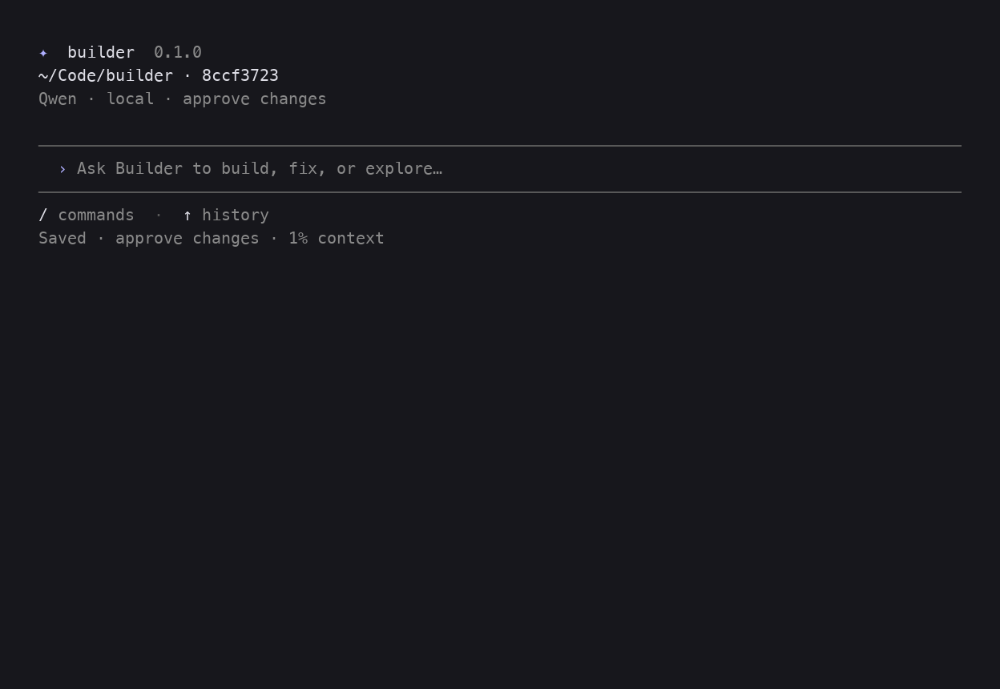
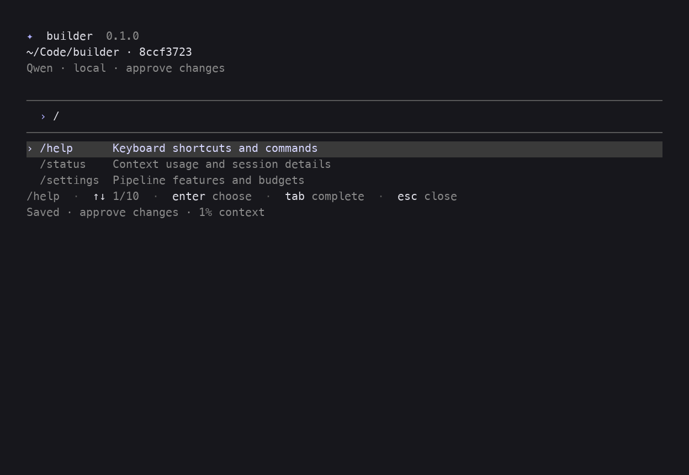
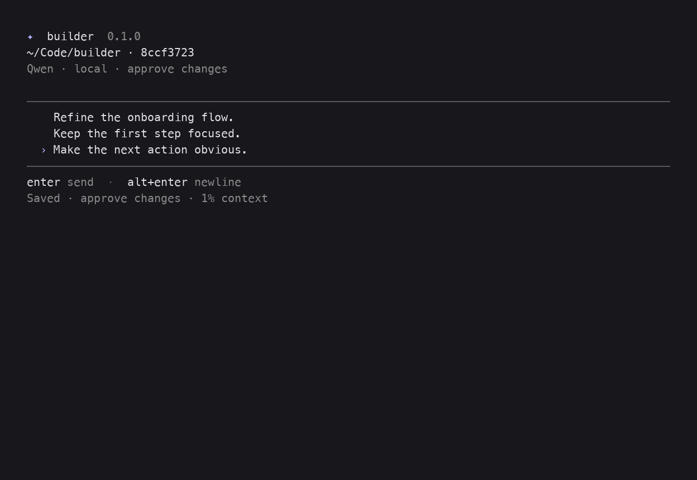
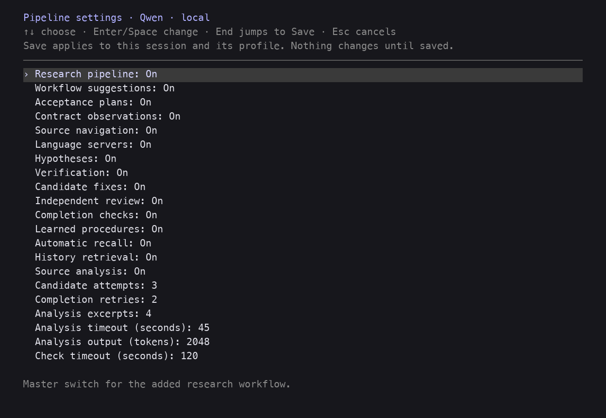
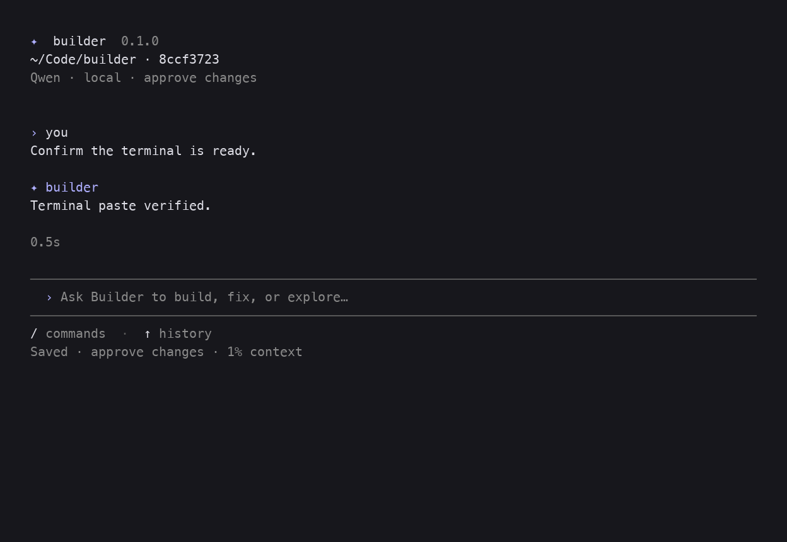
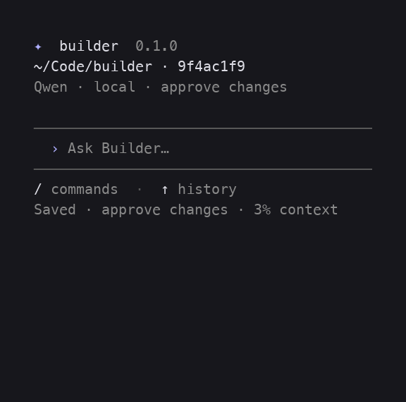

# Interface captures

These screenshots show Builder's terminal and browser interfaces at several
window sizes. They are reference captures rather than generated product assets;
the terminal keeps the user's font, background, scrollback, and color settings.

## Terminal

## Refined layouts

