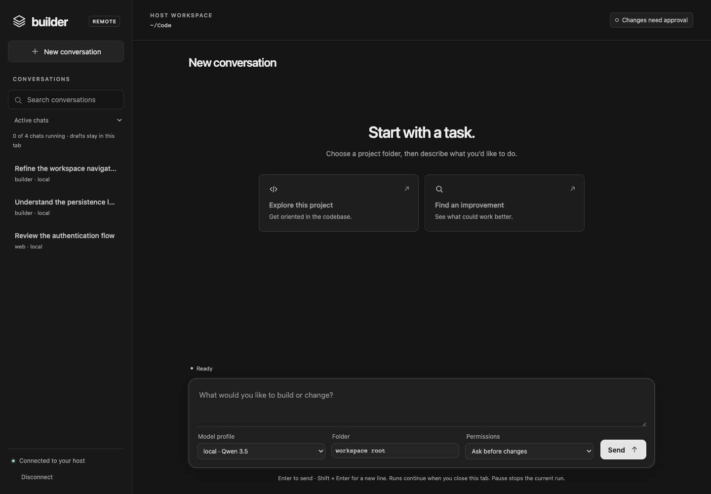

<p align="center"></p>
<h1 align="center">Builder Remote</h1>
<p align="center"><strong>Your coding agent, from any browser.</strong></p>
<p align="center">The gateway relays the interface. Your code, model credentials, conversations, and tools stay on your computer.</p>



## Pick your setup

| I want to… | Use |
| :--- | :--- |
| Open Builder in a browser on the same computer | [Local mode](#local-mode-no-docker) |
| Reach Builder through an existing Pangolin/Newt stack | [Pangolin quick start](#pangolin-quick-start) |
| Keep the host connected after logout on Linux | [Install the host service](#keep-the-host-online-on-linux) |
| Use another reverse proxy or customize networking | [Advanced setup](../docs/REMOTE_CONTROL.md) |

## Local mode—no Docker

If the browser and Builder are on the same computer, this is all you need:

```sh
builder -C /path/to/project remote
```

Open `http://127.0.0.1:7432` and paste the token from the file path printed in
the terminal. The server binds to loopback by default.

## Pangolin quick start

This setup has two pieces:

```text
browser ──HTTPS──▶ Pangolin / Newt ──▶ Builder Gateway
                                              ▲
                                              │ outbound WSS
                                              │
                                      Builder on your computer
```

You need [Builder installed](../README.md#1-install) on the computer that owns
the workspace, plus a Pangolin/Newt Compose stack with container-label
discovery enabled.

### 1. Add the gateway to Pangolin

Add these values to the `.env` beside your existing Pangolin `compose.yml`:

```dotenv
BUILDER_GATEWAY_ORIGIN=https://builder.example.com
BUILDER_DOMAIN=builder.example.com
```

From that same directory, layer in Builder's two Compose fragments:

```sh
docker compose \
  -f compose.yml \
  -f /path/to/builder/remote/compose.yaml \
  -f /path/to/builder/remote/pangolin-labels.yaml \
  up -d builder-gateway
```

The gateway image is pulled from
`ghcr.io/j-reed700/builder-gateway:latest`. Because it joins the existing
Compose project, Newt can reach it at `builder-gateway:8080` without publishing
a public host port.

Check that it started:

```sh
docker compose \
  -f compose.yml \
  -f /path/to/builder/remote/compose.yaml \
  -f /path/to/builder/remote/pangolin-labels.yaml \
  ps builder-gateway
```

### 2. Pair your computer

Open `https://builder.example.com`, sign in through Pangolin, and click
**Generate connect command**. Run the displayed command in the workspace you
want Builder to control:

```sh
cd /path/to/project
builder remote connect https://builder.example.com --code CODE_FROM_DASHBOARD
```

The invitation expires after ten minutes. After pairing, Builder stores a
private device credential, so future connections do not need another code:

```sh
builder -C /path/to/project remote connect https://builder.example.com
```

That is the complete install. Return to the browser and start a conversation.

## Standalone gateway checkout

If the gateway is managed separately from the Pangolin Compose files, start it
from this directory:

```sh
cp .env.example .env
# Edit .env with your public URL and hostname.
docker compose up -d
```

The example enables `compose.yaml` and `pangolin-labels.yaml`. If Newt is on a
separate external Docker network, set `BUILDER_PROXY_NETWORK` and change
`COMPOSE_FILE` as shown in `.env.example` so `proxy-network.yaml` is included.

To build the image from this checkout instead of pulling it:

```sh
docker compose \
  -f compose.yaml \
  -f compose.build.yaml \
  -f pangolin-labels.yaml \
  build builder-gateway
```

## Keep the host online on Linux

The included installer pairs the computer and creates a systemd user service.
It does not need sudo:

```sh
remote/install-host-service.sh \
  --gateway https://builder.example.com \
  --code CODE_FROM_DASHBOARD \
  --workspace /path/to/project
```

Useful service commands:

```sh
systemctl --user status builder-remote
journalctl --user -u builder-remote -f
systemctl --user restart builder-remote
```

If your model profile reads credentials from environment variables, add them to
`~/.config/builder/remote.env` and restart the service. The installer will tell
you if systemd lingering must be enabled to stay connected after logout.

## Update

Update the gateway container:

```sh
docker compose pull builder-gateway
docker compose up -d builder-gateway
```

Update the host by pulling the repository and running `./install.sh` again.
Pairing credentials and conversations are preserved.

## Security in one minute

- Keep the gateway behind Pangolin SSO or another identity-aware reverse proxy.
- Do not publish port 8080 directly to the internet. The supplied Compose file
  binds it to `127.0.0.1` by default.
- Only the single-use connector path bypasses browser SSO; it still requires a
  pairing code or saved device credential.
- The gateway stores pairing state in `builder-gateway-data`. It does not mount
  the host filesystem, Docker socket, Builder data, or model credentials.
- Browser permissions do not sandbox approved shell commands. Those run as the
  account that started Builder.

Read the full [deployment, threat model, recovery, and troubleshooting guide](../docs/REMOTE_CONTROL.md).

## Quick troubleshooting

| Problem | Fix |
| :--- | :--- |
| Gateway page does not open | Confirm DNS/TLS, Pangolin label discovery, and `docker compose ps builder-gateway`. |
| Dashboard says the host is offline | Start `builder remote connect` or inspect `journalctl --user -u builder-remote`. |
| Pairing code is rejected | Generate a new code; invitations expire after ten minutes. |
| Connector gets HTTP 302, 401, or 403 | Ensure only `/api/gateway/connect` bypasses interactive SSO. |
| Browser gets HTTP 401 | Confirm the proxy forwards `Remote-User`, or configure `BUILDER_GATEWAY_AUTH_HEADER`. |
| Model credentials are missing | Add the required variables to `~/.config/builder/remote.env` and restart the service. |
